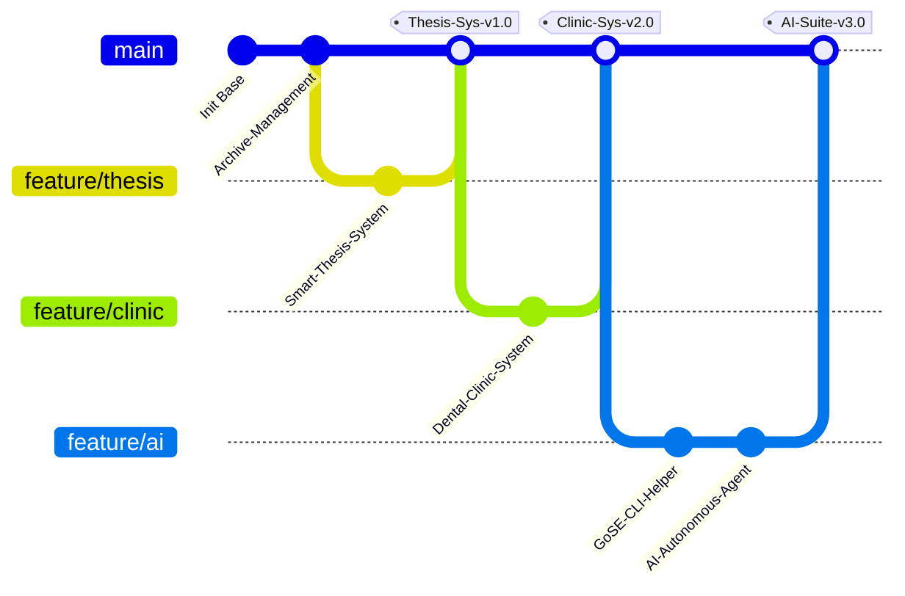

<!-- Hero Banner Section with holographic gradient waving -->
<p align="center">
  
</p>

<!-- Interactive Sub-Header / Status Badges -->
<p align="center">
  
  
  
  
</p>

<!-- Typing Animation Section -->
<p align="center">
  
</p>

<p align="center">
  <a href="https://github.com/cloudy0903">
    
  </a>
</p>

---

### 📡 System Diagnostics: Profile.json

```json
{
  "identity": {
    "name": "Sugiyanto Prasetio",
    "codename": "cloudy0903",
    "origin": "Indonesia 🇮🇩"
  },
  "core_focus": {
    "primary": "Full-Stack Web Development & UI/UX Design",
    "secondary": "End-to-End Digital Creation & IT Support",
    "passion": ["Web Development", "UI/UX Design", "Social Media Specialist", "IT Systems & Support"]
  },
  "education": {
    "degree": "Bachelor of Information Systems",
    "status": "Active / Continuously Learning 🧠"
  }
}
```

---

### 🛠️ Tech Arsenal

<table align="center" width="100%">
  <tr>
    <td width="50%" valign="top">
      <h4>🖥️ Frontend Core</h4>
      
      
      <br/>
      
      
    </td>
    <td width="50%" valign="top">
      <h4>⚙️ Backend Architecture</h4>
      
      
      <br/>
      
    </td>
  </tr>
  <tr>
    <td width="50%" valign="top">
      <h4>🗄️ Storage & Database</h4>
      
      
      <br/>
      
    </td>
    <td width="50%" valign="top">
      <h4>☁️ Cloud & DevOps</h4>
      
      
      <br/>
      
    </td>
  </tr>
</table>

---

### 🌿 Git Flow Journey (Projects & Milestones)

Here is a visual branch representation of my key developments:



---

### 📊 GitHub Diagnostics & Activity

<p align="center">
  
</p>

<table align="center" width="100%">
  <tr>
    <td align="center" width="50%">
      
    </td>
    <td align="center" width="50%">
      
    </td>
  </tr>
  <tr>
    <td align="center" colspan="2">
      <br />
      
    </td>
  </tr>
</table>

<p align="center">
  
</p>

---

### ⭐ Featured Open Source Repositories

| Project | Description | Primary Stack | Link |
| :--- | :--- | :--- | :--- |
| 🤖 **GOSE CLI** | Interactive terminal helper powered by LLMs. | TypeScript, Node.js | [Explore Repo](https://github.com/cloudy0903) |
| 🏥 **Dental Care** | Enterprise-grade Clinic & Patient Management. | React, Laravel | [Explore Repo](https://github.com/cloudy0903) |
| 🎓 **Smart Thesis** | Academic workflows & automatic progress auditor. | Next.js, MySQL | [Explore Repo](https://github.com/cloudy0903) |
| 📦 **Archive System** | Fast, secure digital file indexing and archiving. | Laravel, Bootstrap | [Explore Repo](https://github.com/cloudy0903) |

---

### ⚡ System Resources & Core Progress

<table align="center" width="100%">
  <tr>
    <td width="50%" valign="top">
      <h4>🧠 Live Resource Allocations</h4>
      <pre>
COGNITIVE LOAD:
[■■■■■■■■■■■■■■■■░░░░] 80% (Creative & Dev Flow)

CACHE MEMORY:
[■■■■■■■■■■■■░░░░░░░░] 60% (Context Protocols)

NETWORK SYNC:
[■■■■■■■■■■■■■■■■■■░░] 90% (GitHub Clones)

SYSTEM TEMPERATURE:
[■■■■■■■■░░░░░░░░░░░░] 40% (Cooling Optimal)
      </pre>
    </td>
    <td width="50%" valign="top">
      <h4>📚 Learning Vectors</h4>
      <pre>
Full-Stack Development
██████████████████ 95%

UI/UX Design
████████████████░░ 85%

IT Systems & Support
█████████████████░ 90%

Digital Creation & Media
██████████████░░░░ 70%
      </pre>
    </td>
  </tr>
</table>

---

### 🎵 Current Cyber Track

<p align="center">
  <pre>
┌──────────────────────────────────────────────┐
│  🎧 Spotify Active Session                   │
├──────────────────────────────────────────────┤
│  🔊 Now Playing: Coding in the Matrix        │
│  👤 Artist: Synthwave AI                     │
│  💿 Album: Cybernetic Symphony (2026)        │
│  ⏮  ||  ⏭   02:45 / 04:20                    │
│  ━━━━━━━●━━━━━━━━━━━━━━━━━━━━━━━━━━━━━       │
└──────────────────────────────────────────────┘
  </pre>
</p>

---

### 🐍 Contribution Grid Crawler

<p align="center">
  
</p>

---

### 💬 System Loop

```javascript
while (alive) {
    learn();
    build();
    share();
}
```

---

### 🌐 Secure Hyperlink Ports

<p align="center">
  <a href="https://github.com/cloudy0903" target="_blank">
    
  </a>
  <a href="https://linkedin.com/in/sugiyanto-prasetio" target="_blank">
    
  </a>
  <a href="https://cloudy0903.github.io" target="_blank">
    
  </a>
  <a href="mailto:sugiyantoprasetio.dev@gmail.com">
    
  </a>
  <a href="https://instagram.com/sugiyantoprasetio" target="_blank">
    
  </a>
</p>

---

<p align="center">
  <sub>Made with ❤️ by <b>Sugiyanto Prasetio</b> • Building the Future with Code</sub>
</p>
